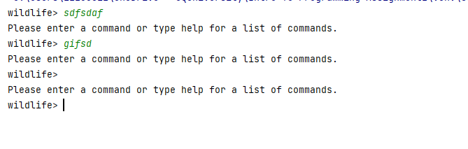
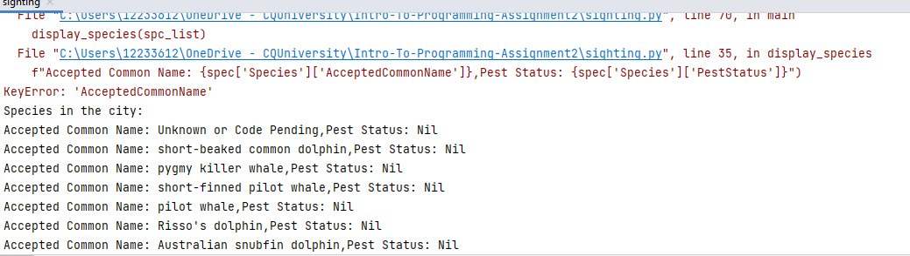

# Intro-To-Programming-Assignment2

## DESCRIPTION:This Python application fetches and analyzes data from web services. It allows users to explore wildlife sightings in Queensland, such as identifying venomous species spotted in a particular area.

TEST PLAN:
when user inputs space or invalid command , the program should prompt the user to enter a valid command

LIMITATIONS:

KNO  bugs: